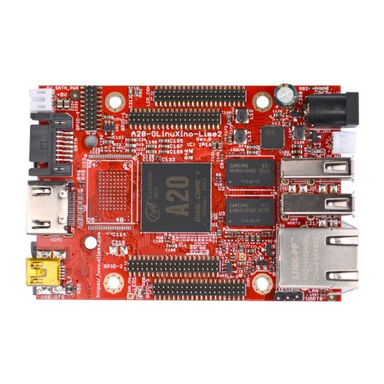

# A20-OLinuXino-LIME2

OPEN SOURCE HARDWARE EMBEDDED ARM LINUX SINGLE BOARD COMPUTER WITH ALLWINNER A20 DUAL CORE CORTEX-A7 1GB RAM AND GIGABIT ETHERNET

Upgraded and improved version of A20-OLinuXino-LIME with double the RAM and Gigabit Ethernet

We offer several variants of this board.
Aside from the base version we offer a variant with extra eMMC or NAND flash memory (suffix -e4GB, -e16GB, or -n8GB);
we have a variant with 16MB SPI flash memory (suffix -s16MB).
We also have variants of the board suitable for industrial temperature range of operation (-40+85)C.
These come with the "T2" chip and have "-IND" suffix in the name.

## Features

- Allwinner A20 dual core Cortex-A7 processor, each core typically running at 1GHz and dual-core Mali 400 GPU
- 1GB DDR3 RAM memory
- 8GB NAND flash memory option (in A20-OLinuXino-LIME2-n8GB)
- 4GB eMMC flash memory option (in A20-OLinuXino-LIME2-e4GB)
- Native SATA support with connector and 5V SATA power jack
- Capable of FullHD (1080p) video playback 
- Native HDMI support with connector
- 2 x USB High-speed host with power control and current limiter
- USB-OTG with power control and current limiter
- 1000MBit native Ethernet
- LiPo Battery connector with battery-charging capabilities
- LCD row of pins (0.05'' step)
- 160 GPIOs on four GPIO rows of pins (0.05'' step)
- MicroSD card connector
- DEBUG-UART connector for console debug with USB-SERIAL-CABLE-F
- GPIO LED
- Battery charge status LED
- Power LED
- 2KB EEPROM for MAC address storage and more
- 3 BUTTONS with ANDROID functionality + RESET button
- 4 mount holes
- 5V DC input power supply jack, noise immune design
- PCB dimensions: (84 x 60)mm ~ (3.3 x 2.4)"

## Documents

- [User manual](manuals/A20-OLinuXino-LIME2-UM.pdf)
- [Board's dimensions](hardware/images/dimensions_A20_lime2.png)
- [Evaluation Board/Kit Important Notice](../../../resources/Evaluation-Board-Notice.md)

## [Hardware](hardware/Technical.md)

## Software

- [FTP folder with latest official Linux images and torrents](ftp://staging.olimex.com/Allwinner_Images/A20-OLinuXino/)
- [Wiki article with official Linux usage and build instructions](https://www.olimex.com/wiki/ArmbianHowTo)
- [Image links, instructions, demo software, customer projects and more](https://www.olimex.com/wiki/A20-OLinuXino-LIME2)